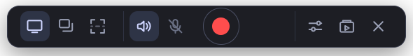
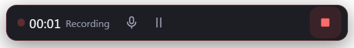

# Capturio

A screen recorder for Windows that stays out of the way. It is a small floating bar, not a window
you visit: choose what to record, switch sound on or off, press the red button.



While recording, the same bar becomes the timer and the controls.



## What it records

- **The whole screen**, **one window**, or **a region** you drag.
- **Sound** as two independent switches: computer audio, microphone, either, both, or neither. Two
  sources are mixed into one track.
- **60 fps** by default, at three quality levels.
- **Pause and resume** mid-recording, and **mute** without ending the recording.

When a recording lands, a small card appears under the bar with the file's name, **Open** and **Show
in folder** — clicking the card itself shows it in the folder. Nothing opens over your work; the card
puts itself away after a few seconds.

Recordings are saved to `Videos\Capturio` as WebM, and the built-in library lets you watch, reveal,
organise and delete them. It browses like a file window — back, forward, up and a breadcrumb —
opening in the recordings folder and never going above it. Click a recording to select it, ctrl-click
to add another, shift-click to take a run, **Ctrl+A** for the lot — then move, bin or delete all of
them at once from the bar that stays at the top of the page as you scroll. Double-click to play, and
right-click for the same options in a menu. Make your own folders, then drag recordings into them (or
onto the breadcrumb to move them back out). Deleting a recording or a folder moves it to the Recycle
Bin unless you explicitly choose otherwise.

## Using it

| | |
| --- | --- |
| ▭ ❐ ⬚ | whole screen, a window, a region |
| 🔊 🎤 | computer sound, microphone — on or off, independently |
| ● | start recording |
| Sliders | quality and microphone choice |
| Library | your recordings, in folders |
| ✕ | hide the bar — it comes back from the tray icon |

**Ctrl+Shift+R** starts and stops from anywhere, so you never have to find the bar first. A red
outline marks a region while it records, and neither the bar nor the outline appears in the
recording.

## Running it

Requires [Node.js](https://nodejs.org) 20 or newer and Windows 10 version 2004 or newer.

```bash
npm install
npm run dev
```

Run it from PowerShell or Windows Terminal rather than VS Code's built-in terminal — VS Code sets a
variable that makes Electron start as plain Node. `CLAUDE.md` explains the symptom if you hit it.

### Installing it

```bash
npm run dist
```

This produces `release/Capturio-Setup-0.1.0.exe`, a normal Windows installer that puts Capturio in
your user profile and adds Start menu and desktop shortcuts — no administrator rights needed.

The installer is **not code-signed**, so Windows SmartScreen will warn the first time you run it
("Windows protected your PC" → More info → Run anyway). Signing needs a certificate, and the
Microsoft Store handles signing itself.

## How it works, where it is not obvious

Screen recording has more sharp edges than it looks, and most of what this project learned is
written down in [`CLAUDE.md`](CLAUDE.md). The parts worth knowing:

**Recordings are finished after they are saved.** Browsers write WebM in a streaming profile with no
duration and no seek index, so the files play but report a length of `Infinity` and cannot be
scrubbed — in any player, not just this one. Capturio rewrites the header once the bytes are safely
on disk, adding the real duration and an index built from video keyframes. Nothing is re-encoded:
the picture and sound are copied byte for byte, and if that rewrite fails for any reason the
recording is still saved, just without the index.

**Nothing is held in memory.** Data is streamed to disk as it arrives, so a five-minute recording
uses the same memory as a five-second one — measured at 333 MB holding flat across five minutes at
the highest quality. MP4 was tested and rejected for exactly this reason: the browser's MP4 writer
emits nothing until you press stop, so a long recording would sit in memory and a power cut would
lose all of it.

**An interrupted recording is recoverable.** Data goes to a `.part` file that is only renamed once
it is complete, so a crash or a flat battery leaves a partial file rather than a corrupt one
pretending to be whole. Capturio reclaims it on the next launch. This is not hypothetical — it was
built after a real recording was lost to a dead battery, and it recovered it.

**Measurements decide, not intuition.** `npm run bench:capture` exists because three separate
"quality fixes" were once shipped against what turned out to be a frame-timing problem. Twice, a
capture limit that looked real turned out to be the test itself. Smoothness here is judged by how
evenly frames are spaced, not by average frame rate — an uneven 29 fps looks broken while a steady
one looks fine.

## Development

| Task | Command |
| --- | --- |
| Run with hot reload | `npm run dev` |
| Type check | `npm run typecheck` |
| Lint | `npm run lint` |
| Production build | `npm run build` |
| All checks | `npm run verify` |
| Capture benchmark | `npm run bench:capture` |
| Regenerate icons | `npm run icons` |

`npm run verify` runs three suites against the shipped modules rather than copies of them: the path
rules that decide which files may be served, byte-range handling, and the finalizer — which asserts
that the media bytes are identical before and after.

Built with Electron, React and TypeScript. No runtime dependencies beyond those.

## Known limits

- **Windows only.** System audio capture uses a Windows-specific mechanism.
- **A minimized window records nothing** — Windows supplies no frames for it.
- **Dark gradients show banding.** Browser video encoding gives no control over the colour
  precision that causes it.
- **Recordings made before seeking was fixed** still report no duration; the player says so when you
  open one.

## Status

Everything listed above works, verified by driving the built and installed app rather than by tests
alone. The installer works; what remains for the Microsoft Store is an MSIX package and a publisher
identity, which is an account matter rather than a build one.
